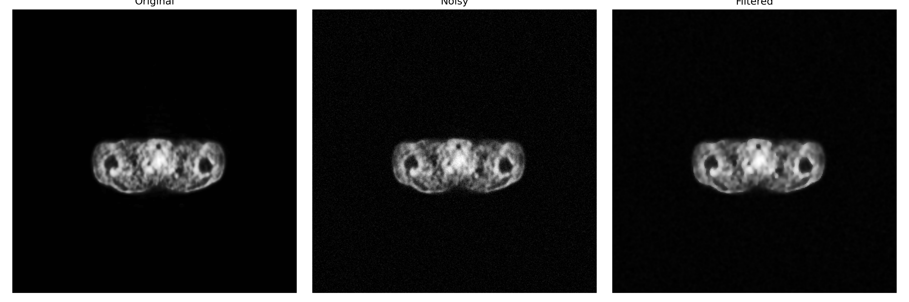
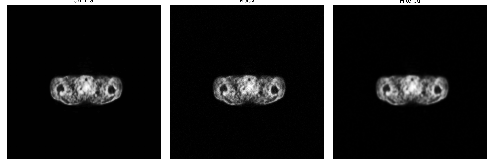
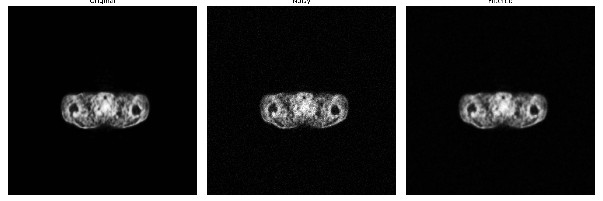

# PDE based denoising with DnCNN enhancement

- Hybrid filter for denoising PET(or PT) scan images using PDE based Anisotropic Diffusion and enhancing the output using Denosing Convolution Neural Network(DnCNN).
---
# Results

## # For Gaussian noise

## # For Poisson noise

## # For Gaussian + Poisson noise
